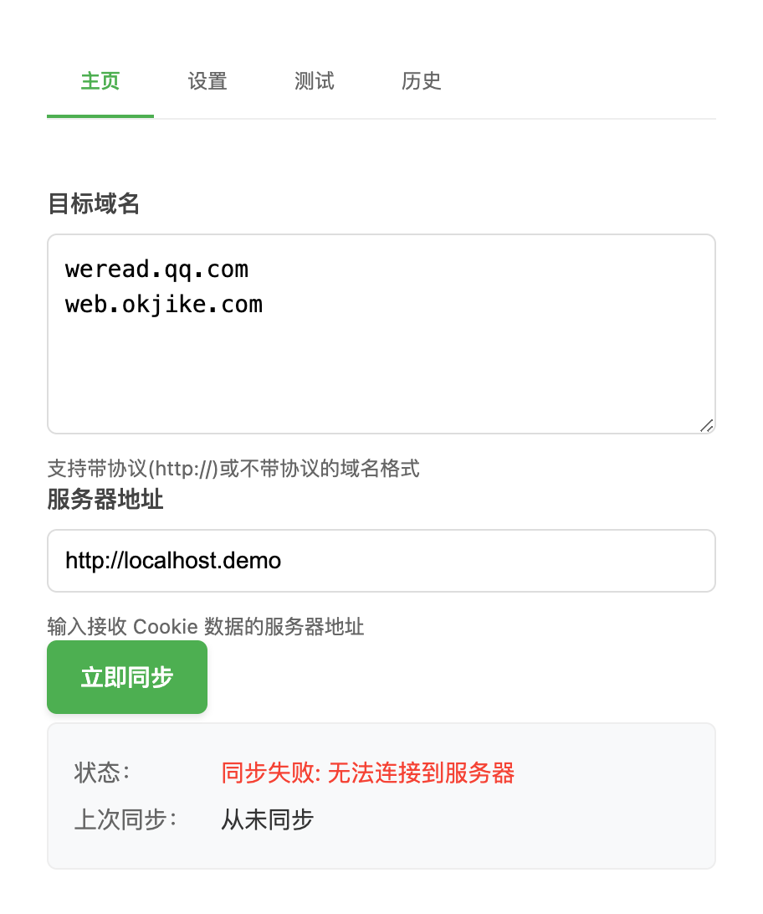
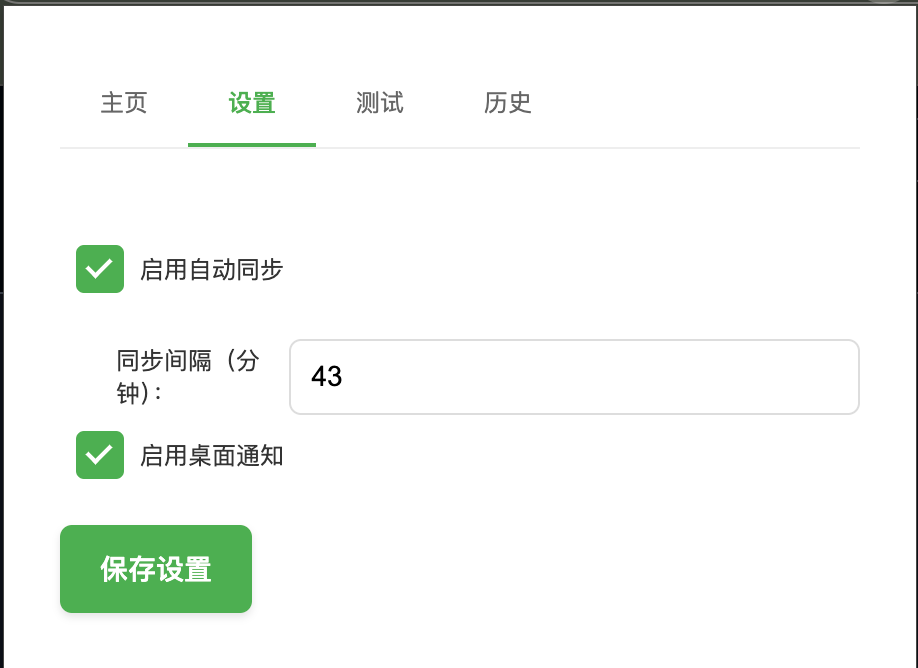
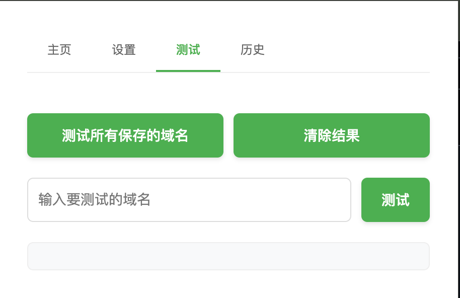
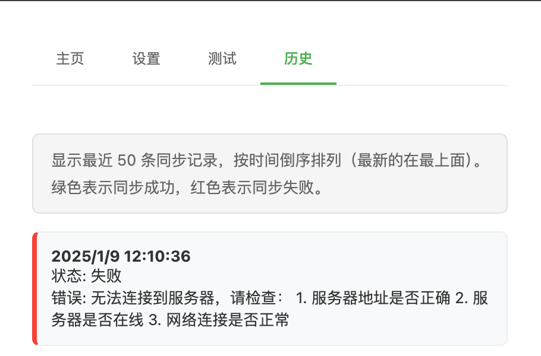

# Cookie Sync Chrome Extension

一个用于自动同步指定域名 Cookie 到服务器的 Chrome 浏览器扩展。

## 功能特性

- 🔄 支持多域名 Cookie 同步
- 🕒 自动定时同步（默认每小时一次）
- 🎯 精确的域名匹配和验证
- 🔒 安全的 HTTPS 数据传输
- 📝 简洁的用户界面
- 🚀 轻量级后台运行

## 安装说明

1. 下载本项目代码
2. 打开 Chrome 浏览器，进入扩展管理页面 (`chrome://extensions/`)
3. 开启右上角的"开发者模式"
4. 点击"加载已解压的扩展程序"
5. 选择项目文件夹即可完成安装

## 使用方法

1. 点击浏览器工具栏中的扩展图标
2. 在弹出窗口中输入需要同步的域名（每行一个）
   - 支持格式：`example.com` 或 `http://example.com`
3. 输入目标服务器地址
4. 点击"同步"按钮即可手动触发同步
5. 插件会自动在后台运行，每小时自动同步一次

## 页面截图

## 权限说明

本扩展需要以下权限：
- 访问指定域名的 Cookie
- 网络请求权限
- 后台运行权限

## 安全说明

- 仅获取用户指定域名的 Cookie
- 所有数据传输使用 HTTPS 加密
- 不在本地保存敏感 Cookie 信息
- 严格的域名格式验证

## 系统要求

- Chrome 浏览器最新版本
- 网络连接正常
- 内存要求：< 50MB

## 问题反馈

如果您在使用过程中遇到任何问题，请通过 GitHub Issues 反馈。

## License

MIT License 